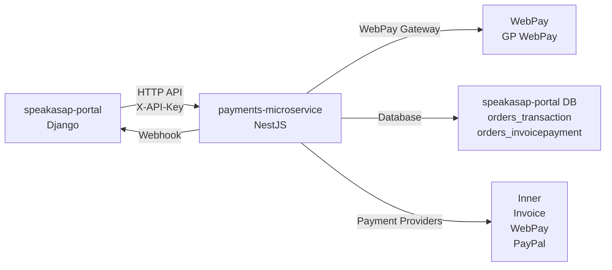

# Speakasap-Portal Payments Refactoring Plan

## Overview

Refactor speakasap-portal payments to use the shared payments-microservice. This involves two phases:

1. **Phase 1**: Complete and enhance payment infrastructure in payments-microservice (WebPay, Inner, Invoice providers)
2. **Phase 2**: Refactor speakasap-portal to use payments-microservice API instead of hardcoded payment implementations

**Important**: payments-microservice is in development phase - we can replace/refactor everything as needed. No need to maintain backward compatibility with existing implementations.

## Architecture



## Current State Analysis

### payments-microservice Current State

**Existing Infrastructure**:

- WebPay, Inner, and Invoice providers already exist but need completion/enhancement
- Basic structure in place: providers, services, factory registration
- Webhook handling infrastructure exists
- API endpoints: `POST /payments/create`, `GET /payments/:paymentId`, `POST /payments/:paymentId/refund`
- Webhook endpoint: `POST /webhooks/webpay` (exists, needs completion)

**Files Status**:

- `src/payments/providers/webpay/webpay.provider.ts` - Already exists
- `src/payments/providers/webpay/webpay.service.ts` - Exists, needs completion (ADDINFO XML, signature handling improvements)
- `src/payments/providers/inner/inner.provider.ts` - Already exists
- `src/payments/providers/inner/inner.service.ts` - Exists, needs database connection and logic fixes
- `src/payments/providers/invoice/invoice.provider.ts` - Already exists
- `src/payments/providers/invoice/invoice.service.ts` - Exists, needs database operations completion
- `src/webhooks/webhooks.controller.ts` - WebPay endpoint already exists
- `src/webhooks/webhooks.service.ts` - Handler exists, needs callback mechanism to speakasap-portal
- `src/payments/entities/payment.entity.ts` - `WEBPAY`, `INNER`, `INVOICE` enums already added
- `src/payments/providers/payment-provider.factory.ts` - All providers already registered
- `src/payments/payments.module.ts` - All providers already added

### speakasap-portal Payment Implementation

**Payment Models** (`orders/models.py`, `orders/paypal/models.py`, `orders/webpay/models.py`, `orders/invoice/models.py`):

- Base `Payment` model with subclasses: `PaypalPayment`, `WebpayPayment`, `CSPayment`, `InvoicePayment`, `InnerPayment`
- Payment methods: `paypal`, `card` (WebPay), `inner`, `invoice`, `internal`
- Payment creation via `PaymentFactory.create_payment()` in `orders/utils.py`
- Payment processing via `payment.pay()` → `order.pay()` chain

**Payment Providers**:

- **PayPal**: Uses `paypalrestsdk`, creates payment via PayPal API, handles return/cancel callbacks
- **WebPay**: Czech bank card payments via WebPay gateway, handles callback via `ProcessView`
- **Inner Payment**: Internal balance-based payments
- **Invoice Payment**: Bank transfer with invoice generation

**Key Payment Flows**:

- **WebPay**: RSA signature generation (`orders/webpay/forms.py`), callback processing (`orders/webpay/views.py`)
- **Inner**: Balance check via `Transaction.get_balance()`, balance deduction on payment
- **Invoice**: Sequential invoice number generation (format: YYMMDDNN), stored in `orders_invoicepayment` table

**Key Files**:

- `orders/models.py` - Payment, Order, Transaction models
- `orders/paypal/views.py` - PayPal return/cancel handlers
- `orders/webpay/views.py` - WebPay payment and callback handlers
- `orders/webpay/forms.py` - WebPay signature generation (RSA-SHA1)
- `orders/utils.py` - PaymentFactory and OrderFactory
- `orders/api_views.py` - REST API endpoints for payments
- `orders/invoice/models.py` - InvoicePayment model and invoice number generation
- `orders/views.py` - InnerPaymentView
- `products/serializers/payment.py` - Payment serializers

## Phase 1: Complete Payment Infrastructure in payments-microservice

**Current State**: WebPay, Inner, and Invoice providers already exist with basic structure but need completion/enhancement. This phase focuses on completing and fixing the existing implementations.

### 1.1 Enhance WebPay Provider

**Location**: `payments-microservice/src/payments/providers/webpay/webpay.service.ts`

**Current State**: Basic structure exists but needs completion

**Tasks**:

1. **Complete signature generation** - Match exact logic from `speakasap-portal/orders/webpay/forms.py`:

   - Ensure signature field order matches exactly: `MERCHANTNUMBER|OPERATION|ORDERNUMBER|AMOUNT|CURRENCY|DEPOSITFLAG|MERORDERNUM|URL|DESCRIPTION|MD|PAYMETHOD|PAYMETHODS|EMAIL|ADDINFO`
   - Use RSA-SHA1 signing with private key (matching Python's `Crypto.Signature.PKCS1_v1_5`)
   - Handle passphrase-protected private key correctly
   - Base64 encode signature
   - Ensure encoding matches speakasap-portal logic exactly (field order, encoding)

2. **Implement ADDINFO XML generation** - For billing details (from `orders/webpay/forms.py` XML_TEMPLATE, lines 21-54):

   - Generate XML structure with billing information when provided in metadata
   - Include customer billing address, company details if available
   - Format: `<additionalInfoRequest><cardholderInfo><billingDetails>...</billingDetails></cardholderInfo></additionalInfoRequest>`
   - Remove newlines from XML string
   - Support billing details from request metadata

3. **Complete callback processing** - Match `WebpayProcessForm.is_signature_valid()` logic exactly:

   - Verify both DIGEST and DIGEST1 signatures correctly
   - DIGEST verification: `OPERATION|ORDERNUMBER|MERORDERNUM|MD|PRCODE|SRCODE|RESULTTEXT`
   - DIGEST1 verification: Same fields + `MERCHANTNUMBER`
   - Handle PRCODE 0 as success, non-zero as failure
   - Extract RESULTTEXT for error messages

4. **Support currency mapping**:

   - EUR = 978, CZK = 203, USD = 840, GBP = 826
   - Default to EUR (978) if currency not mapped

5. **Update webhook handler** - Complete `handleWebPayWebhook` in `webhooks.service.ts`:

   - Process callback data from Webpay gateway (form data or query params)
   - Verify signature using WebPayService.verifyWebhookSignature()
   - Find payment by `providerTransactionId` (ORDERNUMBER or MERORDERNUM)
   - Update payment status (COMPLETED or FAILED)
   - Call speakasap-portal callback URL with payment status

**Environment Variables** (add to `payments-microservice/.env`):

- `WEBPAY_MERCHANT_ID` - Merchant number (from production: `ssh speakasap && cat portal/local_settings.py`)
- `WEBPAY_PASSPHRASE` - Passphrase for RSA key decryption (from production)
- `WEBPAY_URL` - WebPay gateway URL (production: `https://3dsecure.gpwebpay.com/pgw/order.do`, test: `https://test.3dsecure.gpwebpay.com/pgw/order.do`)
- `WEBPAY_PRIVATE_KEY_PATH` - Path to private key file (`keys/des.key`)
- `WEBPAY_PUBLIC_KEY_PATH` - Path to public key file (`keys/publickey.pem`)

**RSA Key Files** (from speakasap-portal):

- Private key: `keys/des.key` (encrypted with passphrase)
- Public key: `keys/publickey.pem` (for signature verification)

**Key handling in payments-microservice**:

- Store keys in secure location (not in git)
- Use environment variable for key paths or store in Docker volume
- Private key requires passphrase for decryption (from `WEBPAY_PASSPHRASE`)
- Copy command: `ssh speakasap && scp keys/des.key keys/publickey.pem <target>`
- Ensure keys directory exists and is in `.gitignore`

**Production credentials location**: `ssh speakasap && cat portal/local_settings.py` (will be added to `.env` during implementation)

### 1.2 Complete Inner Payment Provider

**Location**: `payments-microservice/src/payments/providers/inner/inner.service.ts`

**Current State**: Basic structure exists, needs database connection and logic fixes

**Tasks**:

1. **Configure separate database connection** for speakasap-portal database:

   - Add TypeORM DataSource configuration for speakasap-portal DB
   - Use environment variables: `SPEAKASAP_DB_HOST`, `SPEAKASAP_DB_PORT`, `SPEAKASAP_DB_USER`, `SPEAKASAP_DB_PASSWORD`, `SPEAKASAP_DB_NAME`
   - Use raw SQL queries via `dataSource.query()` method (no TypeORM entities)
   - Inject DataSource into InnerService
   - Configure in `src/shared/database/database.module.ts` or create new module
   - Add connection configuration in `src/app.module.ts`

2. **Fix balance checking logic**:

   - Query `orders_transaction` table: `SELECT COALESCE(SUM(amount), 0) as balance FROM orders_transaction WHERE user_id = $1`
   - Validate balance before payment creation
   - Throw error if insufficient balance

3. **Fix transaction creation logic**:

   - On payment creation: Validate balance (do NOT create transaction yet)
   - On payment completion: Create negative transaction (expense) to deduct balance
   - SQL for payment completion: `INSERT INTO orders_transaction (user_id, amount, comment, order_id, is_income, external, created) VALUES ($1, -$2, $3, $4, false, false, NOW())`
   - `is_income` = false (negative amount for payment)
   - `external` = false for inner payments
   - On refund: Create positive transaction (income) to refund balance

4. **Complete payment flow**:

   - On payment creation: Validate balance only (do NOT create transaction yet)
   - On payment completion: Call `completePayment()` method when payment status changes to COMPLETED
   - Create negative transaction on completion
   - Handle payment completion via `completePayment()` method

5. **Handle refunds**:

   - Create reverse transaction (positive amount) to refund balance
   - Include refund reason in comment field
   - SQL: `INSERT INTO orders_transaction (user_id, amount, comment, order_id, is_income, external, created) VALUES ($1, $2, $3, $4, true, false, NOW())`

**Database Schema Reference** (speakasap-portal):

- Table: `orders_transaction`
- Fields: `id`, `user_id`, `amount`, `comment`, `order_id`, `is_income`, `external`, `created`
- Balance calculation: `SUM(amount) WHERE user_id = ?`
- Transaction creation: Negative amount for payment, positive for refund
- `is_income` = true if amount > 0, false if amount < 0
- `external` = false for inner payments

**Environment Variables** (add to `payments-microservice/.env`):

- `SPEAKASAP_DB_HOST` - speakasap-portal database host
- `SPEAKASAP_DB_PORT` - Database port (default: 5432)
- `SPEAKASAP_DB_USER` - Database username
- `SPEAKASAP_DB_PASSWORD` - Database password
- `SPEAKASAP_DB_NAME` - Database name

### 1.3 Complete Invoice Payment Provider

**Location**: `payments-microservice/src/payments/providers/invoice/invoice.service.ts`

**Current State**: Basic structure exists, needs database operations completion

**Tasks**:

1. **Complete invoice number generation**:

   - Format: YYMMDDNN (e.g., 25010101 for Jan 1, 2025, invoice 01)
   - Calculate min/max numbers for current day: `minNumber = YYMMDD00`, `maxNumber = YYMMDD99`
   - Query `orders_invoicepayment` table for existing invoices on same date
   - SQL: `SELECT number FROM orders_invoicepayment WHERE number > $1 AND number < $2 ORDER BY number DESC LIMIT 1`
   - Generate sequential number per day (increment last number or use minNumber + 1)
   - Handle edge cases (first invoice of day, date rollover)

2. **Implement invoice payment record creation**:

   - INSERT into `orders_invoicepayment` table on payment creation
   - Fields: `number`, `amount`, `ruble`, `scan`, `received`, `actual_amount`, `paid`, `order_id`, `created`
   - Set initial status: `received = false`, `paid = NULL`, `actual_amount = 0`, `ruble = 0`
   - Store invoice number in `providerTransactionId`
   - SQL: `INSERT INTO orders_invoicepayment (number, amount, ruble, received, actual_amount, paid, order_id, created) VALUES ($1, $2, 0, false, 0, NULL, $3, NOW())`
   - Note: `order_id` field may need to reference `orders_order` table via foreign key

3. **Complete payment status checking**:

   - Query `orders_invoicepayment` table by invoice number
   - Return status: `PENDING` (not received), `PROCESSING` (received but not paid), `COMPLETED` (paid)
   - SQL: `SELECT id, number, amount, paid, received, actual_amount, ruble FROM orders_invoicepayment WHERE number = $1 LIMIT 1`

4. **Implement payment confirmation**:

   - Update `received = true` and `actual_amount` when bank transfer confirmed
   - Update `paid = true` when payment is fully processed
   - SQL: `UPDATE orders_invoicepayment SET received = true, actual_amount = COALESCE($1, amount) WHERE number = $2`
   - Call `confirmPayment()` method from payments service

**Database Schema Reference** (speakasap-portal):

- Table: `orders_invoicepayment`
- Fields: `id`, `number` (unique), `amount`, `ruble`, `scan`, `received`, `actual_amount`, `paid`, `order_id`, `created`
- Invoice number generation: Sequential per day (format: YYMMDDNN)
- Initial status: `received = false`, `paid = false` (or NULL)

**Environment Variables**: Uses same `SPEAKASAP_DB_*` variables as Inner payment

### 1.4 Complete Webhook Handling and Add Callback Mechanism

**Location**: `payments-microservice/src/webhooks/webhooks.service.ts`

**Current State**: Webhook endpoint exists, needs callback mechanism to speakasap-portal

**Tasks**:

1. **Complete Webpay webhook handler**:

   - Process callback data from Webpay gateway (form data or query params)
   - Verify signature using WebPayService.verifyWebhookSignature()
   - Find payment by `providerTransactionId` (ORDERNUMBER or MERORDERNUM)
   - Update payment status (COMPLETED or FAILED)
   - Call speakasap-portal callback URL with payment status

2. **Implement callback mechanism to speakasap-portal**:

   - Use `payment.callbackUrl` from payment record or `SPEAKASAP_PORTAL_CALLBACK_URL` + `/api/payments/webhook`
   - Send POST request with payload:

     ```json
     {
       "paymentId": "uuid",
       "orderId": "string",
       "status": "completed|failed",
       "paymentMethod": "webpay|inner|invoice|paypal",
       "event": "completed|failed",
       "timestamp": "ISO8601",
       "metadata": {}
     }
     ```

   - Add retry logic for failed callbacks (max 3 retries with exponential backoff)
   - Support callback authentication (API key via header)
   - Log callback attempts and failures
   - Use HttpService from NestJS

3. **Handle Inner payment completion**:

   - When inner payment status changes to COMPLETED, call `InnerService.completePayment()`
   - Then notify speakasap-portal via callback URL

4. **Handle Invoice payment confirmation**:

   - Provide endpoint or method to confirm invoice payment when bank transfer received
   - Update invoice payment record and notify speakasap-portal

**Callback Flow**:

1. Payment provider (WebPay) → payments-microservice webhook
2. payments-microservice processes payment and updates status
3. payments-microservice calls speakasap-portal callback URL: `POST {SPEAKASAP_PORTAL_CALLBACK_URL}/api/payments/webhook`
4. speakasap-portal updates order/payment status and calls `payment.pay()`

**Environment Variables**:

- `SPEAKASAP_PORTAL_CALLBACK_URL` - Base URL for speakasap-portal (e.g., `https://speakasap.cz`)
- `SPEAKASAP_PORTAL_API_KEY` - API key for callback authentication (optional, can use same as PAYMENT_API_KEY)

**Callback Implementation**:

- Use HttpService from NestJS to make POST requests
- Payload includes: `paymentId`, `orderId`, `status`, `paymentMethod`, `event`, `timestamp`, `metadata`
- Retry logic: Max 3 retries with exponential backoff
- Log all callback attempts and failures

### 1.5 Database Connection Configuration

**Location**: `payments-microservice/src/shared/database/database.module.ts` or create new module

**Tasks**:

1. **Add separate TypeORM DataSource** for speakasap-portal database:

   - Configure connection using `SPEAKASAP_DB_*` environment variables
   - Use raw SQL queries via TypeORM's `dataSource.query()` method (no entities) since we're accessing external database
   - Inject DataSource into InnerService and InvoiceService
   - Add connection configuration in `src/app.module.ts`

2. **Test database connectivity**:

   - Verify connection works from payments-microservice
   - Test queries to `orders_transaction` and `orders_invoicepayment` tables

### 1.6 Environment Configuration

**File**: `payments-microservice/.env`

**Tasks**:

1. **Backup existing .env** before modifications

2. **Add Webpay credentials**:

   - Retrieve from production: `ssh speakasap && cat portal/local_settings.py && cat portal/local_settings_default.py`
   - Add all Webpay-related variables

3. **Add speakasap-portal database connection**:

   - Add all `SPEAKASAP_DB_*` variables

4. **Add callback URL configuration**:

   - `SPEAKASAP_PORTAL_CALLBACK_URL` (optional)
   - `SPEAKASAP_PORTAL_API_KEY` (optional)

5. **Configure centralized logging-microservice**:

   - **Required**: Configure connection to external shared logging-microservice
   - For services on the same Docker network: `LOGGING_SERVICE_URL=http://logging-microservice:3367` or `LOGGING_SERVICE_INTERNAL_URL=http://logging-microservice:3367`
   - For services outside Docker network: `LOGGING_SERVICE_URL=https://logging.statex.cz`
   - Default port: `3367` (configured in `logging-microservice/.env`)
   - Service name: `logging-microservice` (configured in `logging-microservice/.env`)
   - API endpoint: `/api/logs` (default, can be overridden with `LOGGING_SERVICE_API_PATH`)
   - **Reference**: See `logging-microservice/README.md` for complete integration guide, API documentation, and connection examples
   - The LoggerService automatically uses these environment variables for centralized logging

6. **Update .env.example**:

   - Add all new variable names (keys only, no values)
   - Document purpose of each variable
   - Include logging-microservice configuration variables

7. **Copy Webpay RSA keys**:

   - Copy `keys/des.key` and `keys/publickey.pem` from production to `payments-microservice/keys/`
   - Ensure keys directory exists and is in `.gitignore`

**New Environment Variables** (add to `payments-microservice/.env`):

```text
# WebPay Configuration
WEBPAY_MERCHANT_ID=
WEBPAY_PASSPHRASE=
WEBPAY_URL=https://3dsecure.gpwebpay.com/pgw/order.do
WEBPAY_PRIVATE_KEY_PATH=keys/des.key
WEBPAY_PUBLIC_KEY_PATH=keys/publickey.pem

# Speakasap-Portal Database (for Inner and Invoice payments)
SPEAKASAP_DB_HOST=
SPEAKASAP_DB_PORT=5432
SPEAKASAP_DB_USER=
SPEAKASAP_DB_PASSWORD=
SPEAKASAP_DB_NAME=

# Speakasap-Portal Callback
SPEAKASAP_PORTAL_CALLBACK_URL=https://speakasap.cz
SPEAKASAP_PORTAL_API_KEY=

# Logging Microservice Configuration (Required - External Shared Service)
# For services on the same Docker network (recommended):
LOGGING_SERVICE_URL=http://logging-microservice:3367
# OR
LOGGING_SERVICE_INTERNAL_URL=http://logging-microservice:3367

# For services outside Docker network:
# LOGGING_SERVICE_URL=https://logging.statex.cz

# Optional: Override API path (default: /api/logs)
# LOGGING_SERVICE_API_PATH=/api/logs

# Note: See logging-microservice/README.md for connection details and integration guide
# Default port: 3367 (configured in logging-microservice/.env)
# Service name: logging-microservice (configured in logging-microservice/.env)
```

## Phase 2: Refactor speakasap-portal to Use payments-microservice

### 2.1 Create Payment Service Client

**Location**: `speakasap-portal/orders/payment_service.py` (new file)

**Status**: ✅ Completed

**Tasks**:

1. **Create PaymentServiceClient class**:

   - HTTP client using `requests` library
   - Base URL from environment: `PAYMENT_SERVICE_URL`
   - API key authentication via `X-API-Key` header: `PAYMENT_API_KEY`

2. **Implement methods**:

   - `create_payment(order_id, amount, currency, payment_method, customer, callback_url, metadata)` - POST to `/payments/create`
   - `get_payment_status(payment_id)` - GET `/payments/:paymentId`
   - `refund_payment(payment_id, amount=None, reason=None)` - POST `/payments/:paymentId/refund`

3. **Error handling**:

   - Handle HTTP errors (4xx, 5xx)
   - Retry logic for transient failures (max 3 retries)
   - Log errors using Django logging

4. **Response parsing**:

   - Parse JSON responses
   - Extract payment ID, status, redirect URL from responses
   - Handle error responses with appropriate exceptions

**API Integration**:

- Base URL: From `PAYMENT_SERVICE_URL` setting
- Endpoints: `/payments/create`, `/payments/:paymentId`, `/payments/:paymentId/refund`
- Authentication: `X-API-Key` header with `PAYMENT_API_KEY`

**Configuration** (add to `portal/local_settings.py`):

```python
PAYMENT_SERVICE_URL = os.environ.get('PAYMENT_SERVICE_URL', 'https://payments.statex.cz')
PAYMENT_API_KEY = os.environ.get('PAYMENT_API_KEY', '')
```

### 2.2 Create ExternalPayment Model

**Location**: `speakasap-portal/orders/external_payment/models.py` (new file)

**Status**: 🔄 In Progress

**Tasks**:

1. **Create ExternalPayment model**:

   ```python
   class ExternalPayment(Payment):
       external_payment_id = models.CharField(max_length=255, db_index=True)  # Payment ID from microservice
       provider = models.CharField(max_length=50)  # paypal, webpay, inner, invoice
       redirect_url = models.URLField(null=True, blank=True)
       status = models.CharField(max_length=50, default='pending')  # pending, processing, completed, failed
   ```

2. **Purpose**: Store reference to payments-microservice payment while maintaining compatibility with existing Payment model hierarchy and `payment.pay()` flow

3. **Database migration**:

   - Create migration: `python manage.py makemigrations orders`
   - Apply migration: `python manage.py migrate orders`
   - Add `external_payment_id`, `provider`, `redirect_url`, `status` fields
   - No migration of existing payments needed (start fresh per user requirement)

### 2.3 Refactor PaymentFactory

**Location**: `speakasap-portal/orders/utils.py` (PaymentFactory)

**Tasks**:

1. **Update PaymentFactory.create_payment()**:

   - For ALL payment methods (`paypal`, `card`/WebPay, `inner`, `invoice`): Call payments-microservice instead of creating local payment objects
   - Create `ExternalPayment` model instance instead of direct payment models
   - Store `external_payment_id` from microservice response
   - Keep local payment model creation for tracking and compatibility

2. **Handle payment creation flow**:

   - For `card` (WebPay): Call microservice, create `ExternalPayment` with `provider='webpay'`
   - For `inner`: Call microservice, create `ExternalPayment` with `provider='inner'`
   - For `invoice`: Call microservice, create `ExternalPayment` with `provider='invoice'`
   - For `paypal`: Call microservice, create `ExternalPayment` with `provider='paypal'`
   - Return payment object with redirect URL if applicable

3. **Maintain backward compatibility**:

   - Keep PaymentFactory interface the same
   - Internal implementation changes to use payments-microservice

### 2.4 Refactor PayPal Payment Flow

**Location**: `speakasap-portal/orders/paypal/views.py` and `orders/paypal/models.py`

**Tasks**:

1. **Update PaypalReturnView**:

   - Check payment status via microservice
   - Find `ExternalPayment` by `external_payment_id`
   - If approved, call `payment.pay()` → `order.pay()`

2. **Update PaypalPayment.create_payment()**:

   - Call microservice API instead of direct PayPal SDK
   - Store `ExternalPayment` with `external_payment_id`

3. **Flow**:

   - Create payment via payments-microservice API
   - Store `ExternalPayment` with `external_payment_id`
   - Redirect user to `redirectUrl` from microservice response
   - On return, verify payment status via microservice
   - If approved, call `payment.pay()` → `order.pay()`

### 2.5 Refactor WebPay Views

**Location**: `speakasap-portal/orders/webpay/views.py`

**Tasks**:

1. **Update PaymentView**:

   - Replace direct Webpay form generation with `PaymentServiceClient.create_payment()` call
   - Pass `paymentMethod: 'webpay'` in request
   - Include billing details in metadata for ADDINFO XML generation
   - Get `redirectUrl` from microservice response and redirect user to Webpay gateway
   - Store `ExternalPayment` with `external_payment_id`
   - Keep billing form handling (still needed for ADDINFO, pass via metadata)

2. **Update ProcessView** (callback handler):

   - Remove direct Webpay callback processing
   - This view may no longer be needed if Webpay calls payments-microservice directly
   - OR: Keep as fallback and forward to payments-microservice webhook endpoint
   - Update to handle webhook from payments-microservice instead of direct Webpay callback

3. **Update WebpayPayment.create_payment()**:

   - Call microservice API instead of direct WebPay form generation
   - Store `ExternalPayment` with `external_payment_id`

4. **Comment out deprecated code**:

   - Comment out `WebpayForm` signature generation in `orders/webpay/forms.py`
   - Comment out signature generation logic
   - Comment out direct Webpay form creation
   - Comment out direct WebPay form submission (keep ProcessView for backward compatibility initially)
   - Add comments indicating code moved to payments-microservice

**Flow Changes**:

- Old: Generate form → Submit to Webpay → Receive callback → Process payment
- New: Call API → Get redirect URL → Redirect to Webpay → Receive callback at payments-microservice → payments-microservice calls speakasap-portal webhook → Process payment

### 2.6 Refactor Inner Payment Views

**Location**: `speakasap-portal/orders/views.py` (InnerPaymentView)

**Tasks**:

1. **Update InnerPaymentView**:

   - Replace balance checking logic with `PaymentServiceClient.create_payment()` call
   - Pass `paymentMethod: 'inner'` in request
   - Include `userId` in metadata
   - Handle insufficient balance error from payments-microservice
   - Store `ExternalPayment` with `external_payment_id`
   - Keep existing UI/template

2. **Remove local balance checking**:

   - Comment out `Transaction.get_balance()` calls
   - Comment out local transaction creation logic
   - Add comments indicating logic moved to payments-microservice

3. **Update payment completion**:

   - Payment completion handled via webhook from payments-microservice
   - Remove direct payment completion logic

### 2.7 Refactor Invoice Payment Views

**Location**: `speakasap-portal/orders/invoice/views.py`

**Tasks**:

1. **Update PaymentCreateView**:

   - Replace invoice number generation with `PaymentServiceClient.create_payment()` call
   - Pass `paymentMethod: 'invoice'` in request
   - Include `userId` in metadata
   - Get invoice number from microservice response metadata
   - Store `ExternalPayment` with `external_payment_id`
   - Update payment confirmation to call payments-microservice API (if needed) or handle via webhook

2. **Remove invoice number generation**:

   - Comment out `generate_invoice_number()` calls
   - Comment out local invoice payment record creation
   - Add comments indicating logic moved to payments-microservice

3. **Update payment confirmation**:

   - When bank transfer received, call payments-microservice API to confirm payment
   - OR: payments-microservice can be called directly to update invoice status
   - Handle payment status updates from payments-microservice webhook

### 2.8 Add Webhook Endpoint in speakasap-portal

**Location**: `speakasap-portal/orders/webhooks/views.py` (new file)

**Tasks**:

1. **Create webhook endpoint** `/api/payments/webhook`:

   - Django view function or class-based view
   - Accept POST requests with JSON payload
   - Verify webhook authentication (API key or signature if implemented)
   - Use `@csrf_exempt` decorator if needed

2. **Process webhook payload**:

   - Receive webhook from payments-microservice when payment status changes
   - Find `ExternalPayment` by `external_payment_id` (from `paymentId` in payload)
   - Update payment status and call `payment.pay()` if completed
   - Update order status accordingly
   - Handle idempotency (check if payment already processed)

3. **Handle different payment methods**:

   - PayPal: Update PaypalPayment model status via ExternalPayment
   - Webpay: Update WebpayPayment model status via ExternalPayment
   - Inner: Update InnerPayment model status via ExternalPayment, complete order
   - Invoice: Update InvoicePayment model status via ExternalPayment

4. **Error handling**:

   - Log webhook processing errors using Django logging
   - Return appropriate HTTP status codes (200 for success, 400 for errors)
   - Handle duplicate webhook deliveries (idempotency)
   - Handle missing payment records gracefully

5. **Update URLs**:

   - Add webhook URL route in `orders/urls.py`: `url(r'^api/payments/webhook$', webhook_handler, name='payment_webhook')`

**Webhook Payload Structure**:

```json
{
  "paymentId": "uuid",
  "orderId": "string",
  "status": "completed|failed",
  "paymentMethod": "webpay|inner|invoice|paypal",
  "event": "completed|failed",
  "timestamp": "ISO8601",
  "metadata": {}
}
```

**Implementation Notes**:

- Use `ExternalPayment.objects.get(external_payment_id=paymentId)` to find payment
- Check if payment already processed to avoid duplicate processing
- Call `payment.pay(request=None)` when status is 'completed'
- Log all webhook processing for audit trail

### 2.9 Update API Views

**Location**: `speakasap-portal/orders/api_views.py`

**Tasks**:

1. **Update MyOrderMethodView.post()**:

   - Already uses PaymentFactory, will automatically use microservice after PaymentFactory refactoring
   - Payment serializers remain unchanged (they work with Payment model, ExternalPayment extends Payment)
   - No changes needed if PaymentFactory is properly refactored

2. **Ensure compatibility**:

   - API endpoints continue to work with existing serializers
   - Payment models maintain backward compatibility

### 2.10 Comment Out Deprecated Code

**Tasks**:

1. **Comment out (don't delete) old payment processing logic**:

   - `orders/webpay/forms.py` - WebpayForm signature generation
   - `orders/webpay/views.py` - Direct WebPay form submission (keep ProcessView for backward compatibility initially)
   - `orders/invoice/models.py` - Invoice number generation function
   - `orders/models.py` - Transaction.get_balance() calls (keep method for reference)
   - Direct payment provider integrations

2. **Add comments**:

   - Indicate code is deprecated and moved to payments-microservice
   - Reference payments-microservice location
   - Keep for reference during migration period

3. **Keep models and methods**:

   - Keep all payment models for database compatibility
   - Models still needed for local tracking and database schema
   - Keep `payment.pay()` method as it's still used by webhook handler

### 2.11 Environment Configuration

**File**: `speakasap-portal/portal/local_settings.py` or `portal/local_settings_default.py`

**Tasks**:

1. **Backup existing local_settings.py** before modifications

2. **Add payments-microservice configuration**:

   ```python
   # Payments Microservice Configuration
   PAYMENT_SERVICE_URL = os.environ.get('PAYMENT_SERVICE_URL', 'https://payments.statex.cz')
   PAYMENT_API_KEY = os.environ.get('PAYMENT_API_KEY', '')
   ```

3. **Update .env** (backup first per user rules):

   - Add `PAYMENT_SERVICE_URL` (without values in .env.example)
   - Add `PAYMENT_API_KEY` (without values in .env.example)

### 2.12 Database Migration

**Location**: `speakasap-portal/orders/migrations/`

**Tasks**:

- Create migration for `ExternalPayment` model
- Add `external_payment_id`, `provider`, `redirect_url` fields
- No migration of existing payments needed (start fresh per user requirement)

## Implementation Notes

### Database Access

- payments-microservice uses separate TypeORM DataSource for speakasap-portal database
- Connection details stored in `.env` with `SPEAKASAP_DB_*` prefix
- Read/write access required for `orders_transaction` and `orders_invoicepayment` tables
- Use raw SQL queries via TypeORM's `dataSource.query()` method (no TypeORM entities) since accessing external database

### Key Management

- WebPay RSA keys copied to `payments-microservice/keys/` directory
- Key paths configured via environment variables
- Keys should not be committed to git (already in `.gitignore`)
- Copy keys from production: `ssh speakasap && scp keys/des.key keys/publickey.pem <target>`
- Keys need to be copied manually from production server

### Testing Strategy

**Phase 1 Testing**:

- Test WebPay provider creation in payments-microservice
- Test WebPay callback signature verification
- Test payment status updates via webhooks
- Test Inner payment balance checking and transaction creation
- Test Invoice payment invoice number generation and database operations
- Verify database connections work correctly

**Phase 2 Testing**:

- Test payment creation via speakasap-portal → payments-microservice
- Test PayPal payment flow end-to-end
- Test WebPay payment flow end-to-end
- Test Inner payment flow (balance check and deduction)
- Test Invoice payment flow (invoice generation and confirmation)
- Test webhook callbacks from microservice to speakasap-portal
- Test error handling and retry logic

**Production Testing Notes**:

- No sandbox environment available - use production carefully
- Test with real accounts and real money when needed
- Ensure no suspicious activities that could trigger gateway bans
- Monitor payment gateway logs for any issues

### Migration Strategy

- Phase 1 can be deployed independently
- Phase 2 requires Phase 1 to be complete and tested
- Use feature flags if needed to gradually migrate traffic
- Keep old code commented for rollback capability
- Start fresh with new payments only (existing payments remain as-is)
- Test thoroughly before removing commented code

### Error Handling

- All payment operations should have proper error handling
- Log errors using centralized logging microservice
- Return meaningful error messages to speakasap-portal
- Handle network failures gracefully with retries (max 3 retries with exponential backoff)
- Handle payment gateway timeouts appropriately
- Log all payment operations for audit trail

### Extensive Logging Requirements

**CRITICAL**: Extensive logging is required for all tasks in this refactoring project. This is essential for:
- Development and debugging
- Production monitoring during initial deployment phase
- Error tracking and troubleshooting
- Audit trail for payment operations

**Logging Requirements for Every Task**:

1. **Use Centralized Logging Service**:
   - Configure connection to external shared logging-microservice: `LOGGING_SERVICE_URL=http://logging-microservice:3367`
   - For services on Docker network: `LOGGING_SERVICE_INTERNAL_URL=http://logging-microservice:3367`
   - For services outside Docker network: `LOGGING_SERVICE_URL=https://logging.statex.cz`
   - Reference: See `logging-microservice/README.md` for complete integration guide

2. **Log All Operations**:
   - Payment creation attempts (with context: orderId, paymentMethod, amount, currency)
   - API calls to microservice (request/response without sensitive data)
   - Database operations (queries, updates, inserts)
   - Webhook processing (incoming webhooks, callback attempts)
   - Payment status changes (status transitions)
   - Error occurrences (with full context and stack traces)
   - Retry attempts (with attempt number and delay)
   - Timeout occurrences

3. **Log Levels**:
   - `error` - Failures, exceptions, critical errors
   - `warn` - Warnings, retries, non-critical issues
   - `info` - Operations, status changes, important events
   - `debug` - Detailed flow, method entry/exit, detailed context

4. **Never Log Sensitive Data**:
   - API keys, passwords, passphrases
   - Full payment details (card numbers, CVV)
   - Private keys or signatures
   - Full customer data (use IDs or masked data)
   - Database credentials

5. **Log Context**:
   - Include relevant IDs (paymentId, orderId, userId)
   - Include operation type and status
   - Include timestamps
   - Include error details (message, code, stack trace for errors)
   - Include request/response metadata (without sensitive data)

6. **Implementation**:
   - **payments-microservice**: Use centralized LoggerService from `shared/logger/logger.service.ts` which integrates with logging-microservice
   - **speakasap-portal**: Use Django logging system with centralized logging service integration if available
   - All logging should be structured and include context for easy filtering and searching

**Note**: Each task in this refactoring plan includes a specific logging subtask. Ensure extensive logging is implemented for every operation to simplify development and enable effective error tracking in production.

### Security

- API key authentication for payments-microservice API
- Webhook signature verification for callbacks
- Secure storage of Webpay credentials and keys
- Database credentials stored in environment variables only
- **Keys NEVER committed to git** - `.gitignore` configured to exclude:
  - Entire `keys/` directory (except `keys/README.md` documentation)
  - All key file extensions: `*.pem`, `*.key`, `*.crt`, `*.cer`, `*.pfx`, `*.p12`, `*.rsa`, `*.dsa`, `*.ec`, `*.der`
  - Files with `*private*` or `*public*` in filename
- Keys must be copied manually from production server
- Key files should have restricted permissions (chmod 600) on deployment servers

## Files to Modify

### payments-microservice

- `src/payments/providers/webpay/webpay.service.ts` - Complete ADDINFO XML, improve signature handling
- `src/payments/providers/inner/inner.service.ts` - Fix database connection, balance logic, transaction creation
- `src/payments/providers/invoice/invoice.service.ts` - Complete invoice record creation
- `src/webhooks/webhooks.service.ts` - Add callback mechanism to speakasap-portal
- `src/webhooks/webhooks.controller.ts` - Webpay endpoint (already exists, needs completion)
- `src/app.module.ts` or `src/shared/database/database.module.ts` - Add separate database connection for speakasap-portal
- `.env` - Add WebPay, database, and callback configuration
- `.env.example` - Add variable names

### speakasap-portal

- `orders/payment_service.py` - Payment service client (✅ completed)
- `orders/external_payment/models.py` - ExternalPayment model (🔄 in progress)
- `orders/utils.py` - Refactor PaymentFactory
- `orders/webpay/views.py` - Refactor to use API
- `orders/webpay/models.py` - Update WebpayPayment.create_payment()
- `orders/webpay/forms.py` - Comment out WebpayForm signature generation
- `orders/paypal/views.py` - Refactor PayPal return handler
- `orders/paypal/models.py` - Update PaypalPayment.create_payment()
- `orders/views.py` - Refactor InnerPaymentView
- `orders/invoice/views.py` - Refactor invoice views
- `orders/invoice/models.py` - Comment out invoice number generation
- `orders/webhooks/views.py` - New webhook endpoint
- `orders/urls.py` - Add webhook URL route
- `orders/api_views.py` - Update API views (if needed)
- `portal/local_settings.py` - Add payments-microservice configuration
- `portal/local_settings_default.py` - Add payments-microservice configuration defaults
- `orders/migrations/` - Create migration for ExternalPayment
- `.env` - Add PAYMENT_SERVICE_URL and PAYMENT_API_KEY (backup first)
- `.env.example` - Add variable names (keys only, no values)

## Critical Questions Resolved

1. **Webpay callback URL**: Should Webpay call payments-microservice directly, or should it still call speakasap-portal which forwards to payments-microservice?

   - **Decision**: Webpay should call payments-microservice directly, payments-microservice then calls speakasap-portal webhook

2. **Invoice payment confirmation**: How is invoice payment confirmed when bank transfer received?

   - **Decision**: Manual confirmation via admin interface or automated bank webhook (if available). Confirmation calls payments-microservice API.

3. **Database access**: Should payments-microservice have direct database access or use API?

   - **Decision**: Direct database access for Inner and Invoice payments (required for transaction/invoice record creation)

4. **Payment ID mapping**: How to map payments-microservice payment IDs to speakasap-portal payment records?

   - **Decision**: Create `ExternalPayment` model to store payments-microservice payment IDs and status, maintaining compatibility with existing Payment model hierarchy

## Implementation Decisions (Confirmed)

1. **Inner Payments**: ✅ Move to payments-microservice - requires balance management integration
2. **Invoice Payments**: ✅ Move to payments-microservice - requires invoice generation
3. **PayPal Payments**: ✅ Move to payments-microservice - all payment methods go through microservice
4. **Migration**: ✅ Start fresh - no migration of existing payments needed
5. **WebPay Configuration**: ✅ Credentials stored in production (`portal/local_settings.py`), will be added to `payments-microservice/.env`
6. **Testing Environment**: ✅ No sandbox - use production carefully, test with real accounts when needed
7. **payments-microservice**: ✅ Can replace everything - it's in development phase

## WebPay Configuration Details

**Found in speakasap-portal defaults** (`portal/local_settings_default.py`):

- `WEBPAY_MERCHANT = '277180001'` (test merchant)
- `WEBPAY_URL = 'https://test.3dsecure.gpwebpay.com/pgw/order.do'` (test URL)
- `WEBPAY_PASSPHRASE = "password"` (test passphrase)

**Production values** (to be retrieved from `ssh speakasap && cat portal/local_settings.py`):

- Production merchant ID
- Production WebPay URL (`https://3dsecure.gpwebpay.com/pgw/order.do`)
- Production passphrase
- RSA key files: `keys/des.key` (private) and `keys/publickey.pem` (public)

**RSA Keys**: WebPay requires RSA key pair for signature generation/verification. Keys must be copied from speakasap-portal production to payments-microservice.

## Deployment Order

1. **Phase 1 Deployment**:

   - Deploy payments-microservice with completed providers
   - Test WebPay, Inner, and Invoice providers independently
   - Verify database connections and webhook callbacks

2. **Phase 2 Deployment**:

   - Deploy speakasap-portal with PaymentServiceClient
   - Deploy ExternalPayment model migration
   - Test payment flows end-to-end
   - Monitor webhook callbacks

3. **Verification**:

   - Test all payment methods (WebPay, Inner, Invoice, PayPal)
   - Verify webhook callbacks work correctly
   - Check logs for any errors
   - Monitor payment gateway for suspicious activities

## Rollback Plan

**If issues occur**:

1. Keep old payment code commented out (per user rules)
2. Feature flag to switch between old/new payment flow
3. Database migration can be reversed if needed
4. Payments-microservice changes are backward compatible (new providers added)
5. Can switch back to old payment flow via feature flag if needed

## Documentation Updates

**Files to update**:

- `payments-microservice/README.md` - Document WebPay, Inner, and Invoice providers
- `speakasap-portal/README.md` - Document payment microservice integration
- Add integration guide for speakasap-portal payments
- Document callback mechanism and webhook handling
- Document database connection configuration for speakasap-portal database

## Additional Implementation Details

### WebPay ADDINFO XML Template

The ADDINFO XML structure from `speakasap-portal/orders/webpay/forms.py` (lines 21-54):

```xml
<?xml version="1.0" encoding="UTF-8"?>
<additionalInfoRequest xmlns="http://gpe.cz/gpwebpay/additionalInfo/request" xmlns:xsi="http://www.w3.org/2001/XMLSchema-instance" version="4.0">
<cardholderInfo>
<cardholderDetails>
<name>{name}</name>
<email>{email}</email>
<phoneCountry>{phone_country}</phoneCountry>
<phone>{phone}</phone>
<mobilePhoneCountry>{phone_country}</mobilePhoneCountry>
<mobilePhone>{phone}</mobilePhone>
</cardholderDetails>
<addressMatch>Y</addressMatch>
<billingDetails>
<name>{full_name}</name>
<address1>{address1}</address1>
<address2>{address2}</address2>
<city>{city}</city>
<postalCode>{postal_code}</postalCode>
<country>{country}</country>
<phone>{full_phone}</phone>
<email>{email}</email>
</billingDetails>
<shippingDetails>
<name>{full_name}</name>
<address1>{address1}</address1>
<address2>{address2}</address2>
<city>{city}</city>
<postalCode>{postal_code}</postalCode>
<country>{country}</country>
<phone>{full_phone}</phone>
<email>{email}</email>
</shippingDetails>
</cardholderInfo>
</additionalInfoRequest>
```

**Implementation Notes**:

- Remove newlines from XML string before including in signature
- Country code should be formatted as 3-digit string (e.g., "276" for Germany)
- Phone number should include country code prefix
- All fields should be properly escaped for XML

### Inner Payment Transaction Flow

**Payment Creation**:

- Validate balance only (do NOT create transaction)
- Return payment ID if balance sufficient
- Throw error if insufficient balance

**Payment Completion** (when status changes to COMPLETED):

- Create negative transaction: `INSERT INTO orders_transaction (user_id, amount, comment, order_id, is_income, external, created) VALUES ($1, -$2, $3, $4, false, false, NOW())`
- Comment format: `Оплата заказа {orderId}` or similar
- This deducts balance from user account

**Refund**:

- Create positive transaction: `INSERT INTO orders_transaction (user_id, amount, comment, order_id, is_income, external, created) VALUES ($1, $2, $3, $4, true, false, NOW())`
- Comment format: `Возврат средств: {reason}`

### Invoice Payment Number Generation

**Format**: YYMMDDNN (e.g., 25010101 for Jan 1, 2025, invoice 01)

**Algorithm**:

1. Get current date
2. Calculate minNumber: `parseInt(YYMMDD00, 10)`
3. Calculate maxNumber: `parseInt(YYMMDD99, 10)` or next day's minNumber
4. Query: `SELECT number FROM orders_invoicepayment WHERE number > $1 AND number < $2 ORDER BY number DESC LIMIT 1`
5. If result exists: `return result.number + 1`
6. If no result: `return minNumber + 1`

**Edge Cases**:

- First invoice of day: Returns minNumber + 1
- Date rollover: Uses next day's range for maxNumber
- Concurrent requests: Database unique constraint handles conflicts

### Callback Retry Logic

**Implementation**:

- Max 3 retries with exponential backoff
- Retry delays: 1s, 2s, 4s
- Log each retry attempt
- After 3 failures, log error and mark callback as failed
- Consider implementing callback queue for failed callbacks

**Retry Conditions**:

- Network errors (timeout, connection refused)
- HTTP 5xx errors (server errors)
- Do NOT retry on 4xx errors (client errors)

### Payment Status Mapping

**payments-microservice → speakasap-portal**:

- `PENDING` → `pending` (payment created, waiting for processing)
- `PROCESSING` → `processing` (payment in progress)
- `COMPLETED` → `completed` (payment successful, call `payment.pay()`)
- `FAILED` → `failed` (payment failed, do not call `payment.pay()`)
- `CANCELLED` → `cancelled` (payment cancelled by user)
- `REFUNDED` → `refunded` (payment refunded)

### Error Codes and Handling

**payments-microservice Error Responses**:

- `PAYMENT_CREATION_FAILED` - Payment creation error
- `PAYMENT_NOT_FOUND` - Payment ID not found
- `REFUND_FAILED` - Refund processing error
- `INSUFFICIENT_BALANCE` - Inner payment: not enough balance
- `INVALID_PAYMENT_METHOD` - Unsupported payment method
- `WEBHOOK_PROCESSING_FAILED` - Webhook processing error

**speakasap-portal Error Handling**:

- Catch `requests.exceptions.RequestException` for network errors
- Parse error responses from payments-microservice
- Log errors with context (order ID, payment method, user ID)
- Return user-friendly error messages
- Handle timeout errors gracefully
- Retry logic for transient failures (max 3 retries with exponential backoff)

## Summary

This comprehensive plan consolidates all payment refactoring requirements from previous planning documents (PAYMENTS_REFACTORING_PLAN_1.md, PAYMENTS_REFACTORING_PLAN_2.md, PAYMENTS_REFACTORING_PLAN_3.md) into a single authoritative document.

**Key Points**:

- **Phase 1**: Complete and enhance payment infrastructure in payments-microservice (WebPay, Inner, Invoice providers)
- **Phase 2**: Refactor speakasap-portal to use payments-microservice API for all payment methods
- **Status**: Payment service client completed, ExternalPayment model in progress, WebPay provider enhancement in progress
- **Approach**: Start fresh with new payments only, existing payments remain as-is
- **Testing**: Use production carefully (no sandbox), test with real accounts when needed
- **Migration**: Phase 1 can be deployed independently, Phase 2 requires Phase 1 completion

**Next Steps**:

1. Complete WebPay provider enhancement (ADDINFO XML, signature handling)
2. Fix Inner payment provider (database connection, transaction logic)
3. Complete Invoice payment provider (database operations, invoice number generation)
4. Implement callback mechanism in webhooks service
5. Configure database connection for speakasap-portal database
6. Complete ExternalPayment model and migration
7. Refactor PaymentFactory to use payments-microservice
8. Refactor all payment views (WebPay, Inner, Invoice, PayPal)
9. Add webhook endpoint in speakasap-portal
10. Test all payment flows end-to-end
